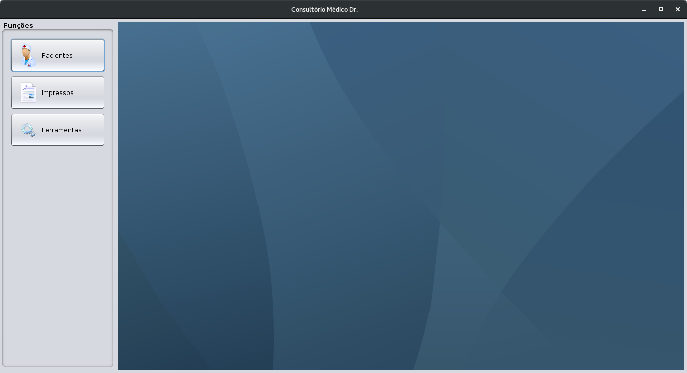
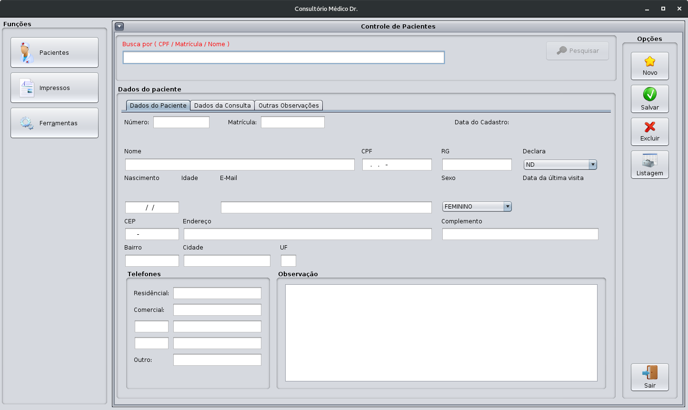
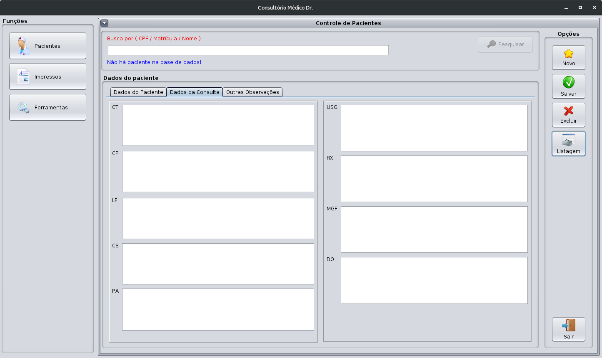
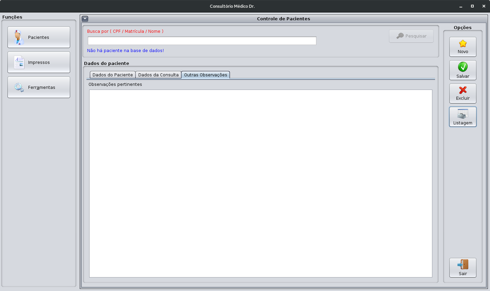
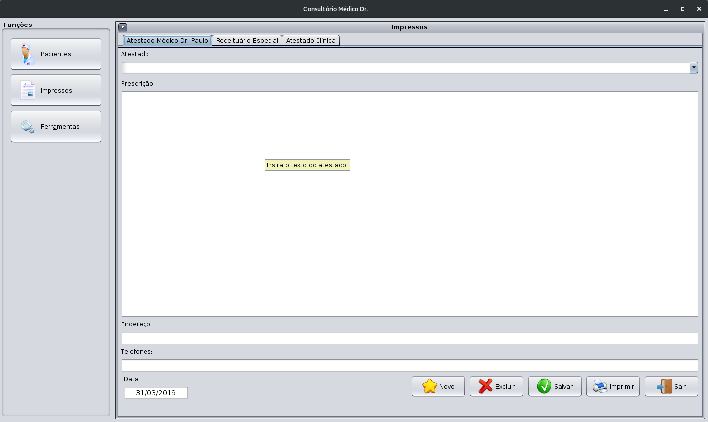
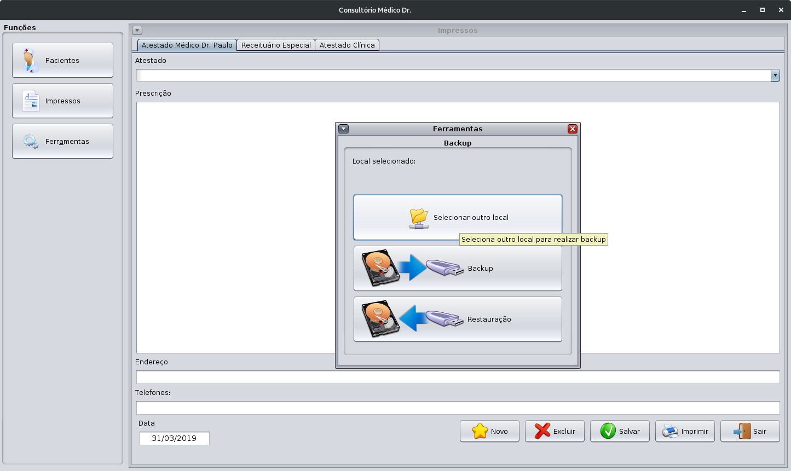

# Programa médico.

Programa criado para geração de receituários e atestados médicos

## Screenshots

### Tela principal

### Telas Cadastro de Pacientes

### Tela de impressos

### Tela de ferramentas

## Descrição
- Projeto criado utilizando NetBeans
- Banco de dados criado em SQLite3 ( mas pode ser com MySQl/MariaDB)

## Observações
> Este projeto não está mais em desenvolvimento, sendo utilizando somente para consulta
> Fique a vontade para copiar alterar e distribuir.

## Licença MIT

---
Criado em 2015
